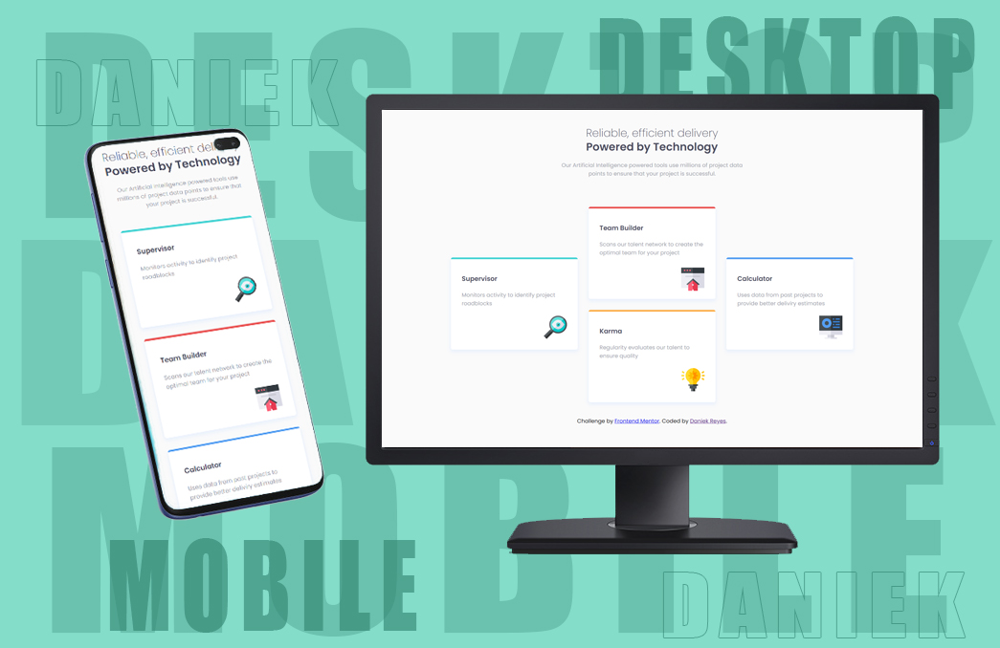

# Escuela de Desarrollo Web by Platzi - Four card feature section

## El reto

El reto era construir un componente de vista previa de un artículo.

## 🛠‍-💻 Tecnologías  
1. HTML
2. CSS

## Créditos por el diseño y reto.

Este reto pertenece a la lista de retos de [Frontend Mentor](https://www.frontendmentor.io)
